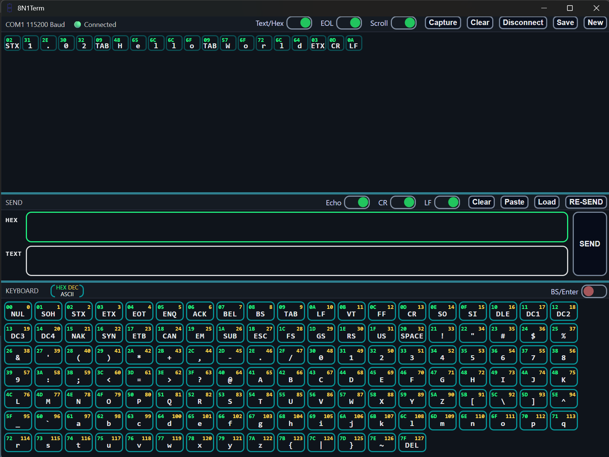

# 8N1Term  
**A next-generation serial terminal that removes ASCII table lookup.**

8N1Term is a modern re-thinking of the classic serial terminal.  
No menus. No modal dialogs. No digging through settings. No ASCII charts.  
Everything is **on screen, visible, and immediately usable**.

---

### Single-Surface IO

---

### 📥 RX On-screen Options

- **Text / HEX** – Toggle integrated text + hex display
- **EOL** – Break lines on CR and/or LF
- **Scroll Lock** – Freeze or auto-scroll incoming data
- **Capture** – Low-level, high-speed capture mode (no UI overhead)
- **Clear** – Clear RX buffer
- **Disconnect** – Close the active COM port
- **Save** – Save RX buffer to file
- **New** – Start a new RX session

---

### 📤 TX On-screen Options

- **Echo** – Mirror TX data into RX window
- **CR & LF** – Auto-append Carriage Return and Line Feed
- **Clear** – Clear TX buffer
- **Paste** – Paste from system clipboard
- **Load** – Load file into TX buffer
- **Re-Send** – Re-transmit last TX payload

---

### 🧠 ASCII Keyboard & Controls

- **BS / Enter Mode** – Use Backspace & Enter as normal keys or raw control codes
- **Full ASCII Set** – All characters available as clickable keys
- **Control & Non-printables** – Send control codes and edge cases instantly
- **Hybrid Input** – Works alongside normal keyboard typing
---

### 🚀 High-Speed Capture (With Low Level Stability)

- Use the **Capture** button to start buffering raw data at full speed  
- Capture **binary streams** without UI stalls, parsing, or crashes  
- Byte-perfect output for **offline analysis**

---

### 📤 Clean File Loading/Saving Separation

- **TXT**: As-Is  
- **RAW**: As-Is  
- **HEX**: Formatted, human readable

---

### ⚡ Built for Real Engineering

For:
- Firmware bring-up  
- Protocol debugging  
- Binary streams  
- Dirty lines  
- Long sessions  
- Large buffers  

“I built it to make messy serial streams readable — without crashes, split screens, or ASCII chart lookups.”