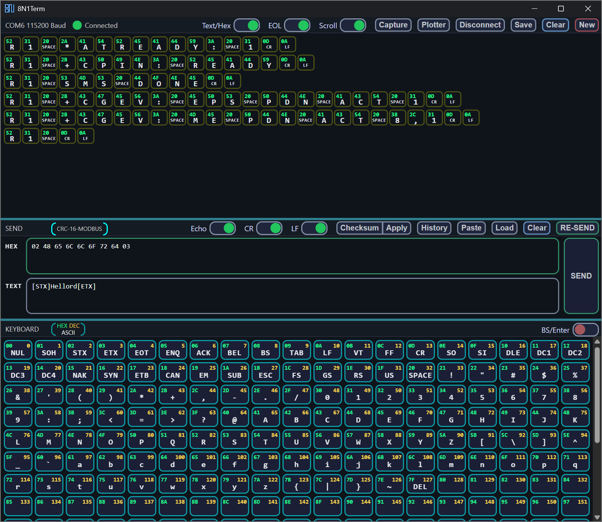
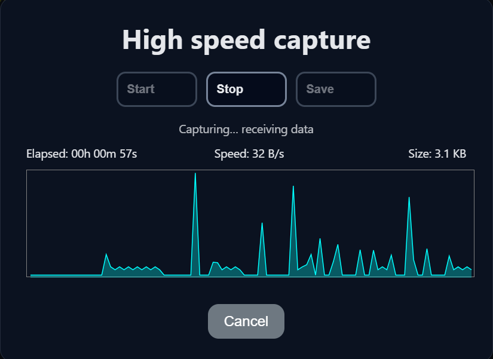
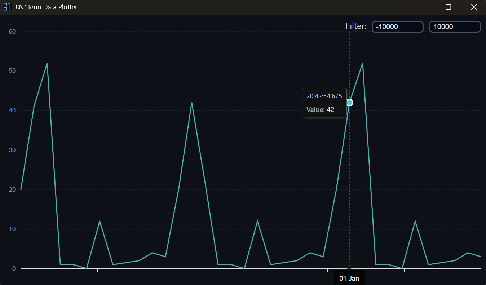

#  8N1Term 
**A next-generation serial terminal that removes ASCII table lookup.**

- 8N1Term is a modern re-thinking of the classic serial terminal.  
- Mixed mode I/O. No Split screens. No menus. No settings. No ASCII charts. 
- Everything is **on screen, visible, and immediately usable**.
- Instant startup, small footprint with Tauri. No Electron. No React.

---

### Single-Surface I/O

---

### Quick start (Windows & Linux)

- Run the installer ([Downloads](https://github.com/C3POAdmin/8N1Term/releases))
- Select a serial port and baud rate
- Type or use the on-screen keyboard
- Hit Enter or Press Send

---

### 📥 RX On-screen Options

- **Text / HEX** – Toggle integrated text + hex display
- **EOL** – Break lines on CR and/or LF
- **Scroll Lock** – Freeze or auto-scroll incoming data
- **Plotter** – Visualize incoming ASCII numeric values as a real-time graph
- **Capture** – Low-level, high-speed capture mode (no UI overhead)
- **Clear** – Clear RX buffer
- **Disconnect** – Close the active COM port
- **Save** – Save RX buffer to file
- **New** – Start a new RX session

---

### 📤 TX On-screen Options

- **Echo** – Mirror TX data into RX window
- **CR & LF** – Auto-append Carriage Return and Line Feed
- **Clear** – Clear TX buffer
- **Paste** – Paste from system clipboard
- **Load** – Load file into TX buffer
- **Re-Send** – Re-transmit last TX payload

---

### 🧠 ASCII Keyboard & Controls

- **BS / Enter Mode** – Use Backspace & Enter as normal keys or raw control codes
- **Full ASCII Set** – All characters available as clickable keys
- **Control & Non-printables** – Send control codes and edge cases instantly
- **Hybrid Input** – Works alongside normal keyboard typing

---

### 🚀 High-Speed Capture (With Low Level Stability)

- Use the **Capture** button to start buffering raw data at full speed  
- Capture **binary streams** without UI stalls, parsing, or crashes  
- Duration, Speed, Size & Jitter/Stall indicators via the sparkline
- Byte-perfect output for **offline analysis**

---

### 📈 Data Plotter

Opens a separate Plotter window for live graphing of **numeric values automatically extracted** from incoming serial data streams.

The plotter is format-agnostic — it detects and plots numbers from **mixed or unstructured input** (plain text, debug output, CSV-style data, ints, floats, etc.) without requiring a fixed protocol or special formatting.

Each plotted data point includes:
- **Extracted numeric value**
- **Time-of-day timestamp** with millisecond precision (`HH:MM:SS.mmm`)

---

### 📤 Clean File Loading/Saving Separation

- **TXT**: As-Is  
- **RAW**: As-Is  
- **HEX**: Formatted, human readable

---

### ⚡ Built for Real Engineering

For:
- Firmware bring-up  
- Protocol debugging  
- Binary streams  
- Dirty lines  
- Long sessions  
- Large buffers  

“I built it to make messy serial streams readable — without crashes, split screens, or ASCII chart lookups.”
